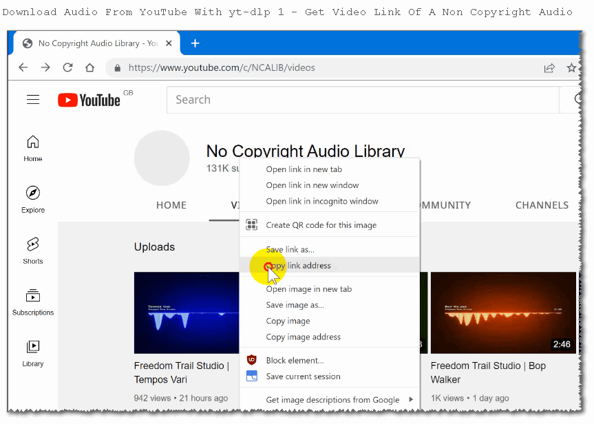
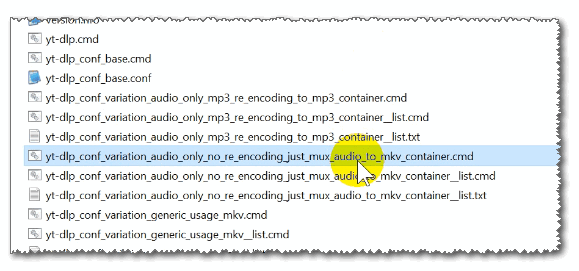
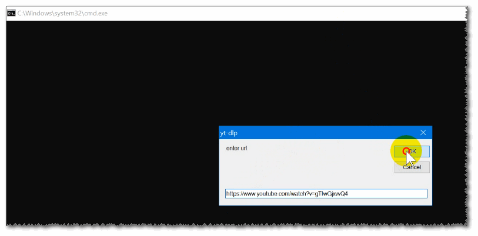
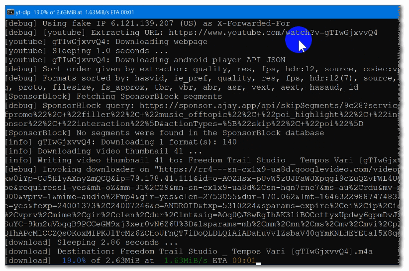
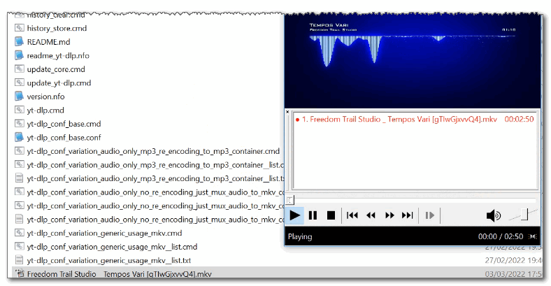
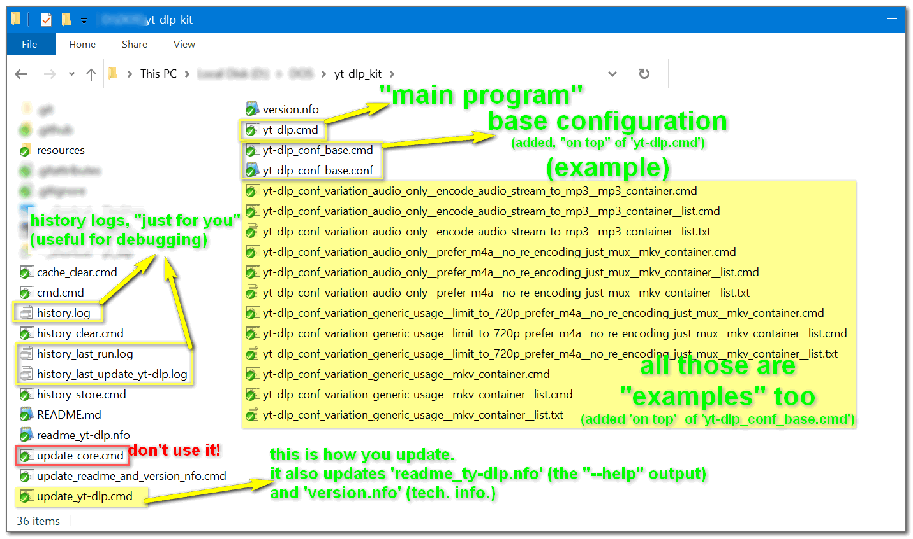
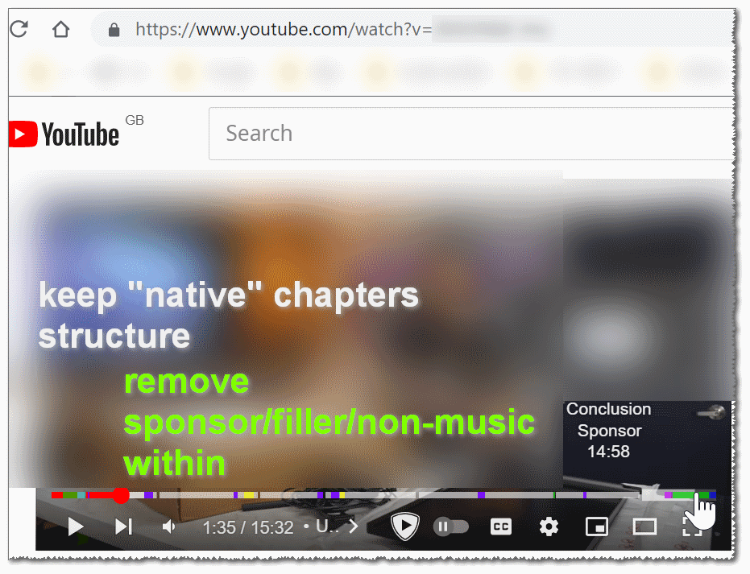
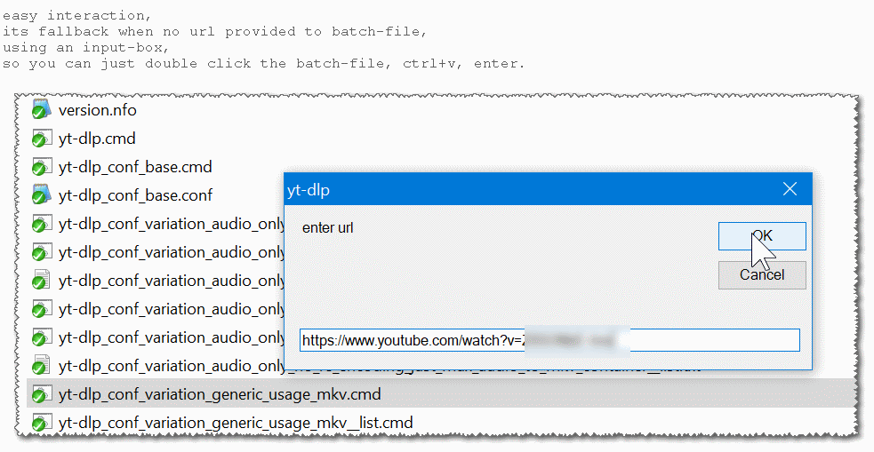
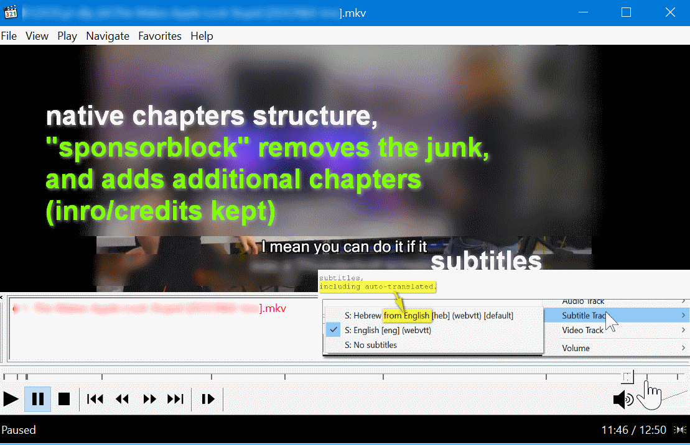

<h1>yt-dlp Kit</h1>

- portable.
- updatable.
- paste URLs easily with an inputbox.
- external dependencies included.
- examples provided (configs, lists, formats, convertions, cookies, ..).

<hr/>

<h3>download: <br/><a href="https://github.com/eladkarako/yt-dlp_kit/archive/refs/heads/master.zip">https://github.com/eladkarako/yt-dlp_kit/archive/refs/heads/master.zip</a></h3>


<br/>
<br/>
<br/>
<hr/>

<details><summary>more information</summary>


external depenencies:  
- ffmpeg with extra codecs (`ffmpeg`, `ffprobe` https://github.com/nanake/ffmpeg-tinderbox)
- aria2 (`aria2c` https://github.com/eladkarako/win_aria2c)
- wget (https://community.chocolatey.org/packages/Wget)
- curl (https://community.chocolatey.org/packages/curl)
- atomicparsley (https://github.com/wez/atomicparsley)
- mpv (https://sourceforge.net/projects/mpv-player-windows/files/64bit/)
- phantomjs (https://bitbucket.org/ariya/phantomjs)
- rtmpdump (http://rtmpdump.mplayerhq.hu)

additional tools included in the package:  
- YTSubConverter (https://github.com/arcusmaximus/YTSubConverter)
- streams (https://docs.microsoft.com/en-us/sysinternals/downloads/streams)
- GNU Core Utils (https://www.gnu.org/software/coreutils/  https://github.com/git-for-windows/git)
- 7zip (https://github.com/eladkarako/7z_bundle)
- upx (https://github.com/upx/upx)


updates:  
- migrating from WinPython+PIP upgrade to plain `https://github.com/yt-dlp/yt-dlp/releases/latest/download/yt-dlp_win.zip` .
- migrating from x86 to x64 (amd64).
- almost everything is binary-patched for Windows 11 compatibility, and exe/dll files were UPX-compressed to reduce their size.
- `version.nfo` holds the current version, it will automatically be updated after each update.

<hr/>

<h3>tl;dr.</h3>

```txt
yt-dlp.cmd
  includes every external-dependency in PATH and runs yt-dlp.
  this is the 'base' batch file with no additions or arguments.
  
yt-dlp_conf_base.cmd
  based on 'yt-dlp.cmd'
  - adds configuration file 'yt-dlp_conf_base.conf' for generic usage.
  embed subtitles, thumbnail, chapters, sponsorblock, 
  network fixes, sleep optimization to prevent ban, multi-part download, 
  and continuing through errors.
  adds local history and a very detailed 'last run' log.
  has no specific format or container.

yt-dlp_conf_variation_audio_only__encode_audio_stream_to_mp3__mp3_container.cmd
  efficient audio only, 
  prefer downloading mp3, but can handle any stream, 
  extract the audio, and force encode to mp3 stream and mp3 container.
  useful for old mp3-audio players.
  
yt-dlp_conf_variation_audio_only__encode_audio_stream_to_mp3__mp3_container__list.cmd
  same as above, but can handle a list.

yt-dlp_conf_variation_audio_only__prefer_m4a__no_re_encoding_just_mux__mkv_container.cmd
  efficient audio only, 
  m4a stream is prefered, but will use whatever possible.
  will save whatever audio it found without re-encoding it, 
  uses MKV container.
  extreamly fast and keeps the same quality due to not encoding anything,  
  very useful for getting audio from YouTube videos, 
  for playing on your computer
  
yt-dlp_conf_variation_audio_only__prefer_m4a__no_re_encoding_just_mux__mkv_container__list.cmd
  same as above, but can handle a list.

yt-dlp_conf_variation_audio_only__prefer_m4a__no_re_encoding_just_mux__mkv_container__time_range_limit_crop_no_re_encode.cmd
  get audio, trim/crop to a specific time.  
  the current example just uses ` --download-sections "*00:00:00-00:07:14"` (for the sake of the example),  
  you can replace it with any value.
  
  note: yt-dlp is a little glitchy with `--download-sections`,  
        if you can just use ffmpeg afterwards, to trim it yourself, it would be better, 
        (especially if you embed chapters, and the video has chapters out of the range you want.
        it will result with the correct video size, but with all the chapters data, from the whole video anyway).

yt-dlp_conf_variation_generic_usage__limit_to_720p_prefer_m4a__no_re_encoding_just_mux__mkv_container.cmd
  this is a video downloader, 
  it limits the video size to 720p, 
  if favors a mp4 and places the result in MKV container.
  it is extreamly useful to YouTube since YouTube has 
  a specific "old-school" format of m4a audio + h264 video.
  720p is sufficient in most cases and does not take a lot of space.
  will fallback to any video format and size and any audio format if it can't find one.
  
yt-dlp_conf_variation_generic_usage__limit_to_720p_prefer_m4a__no_re_encoding_just_mux__mkv_container__list.cmd
  same as above, but can handle a list.
  
yt-dlp_conf_variation_generic_usage__mkv_container.cmd
  non-specified format, just asks to use MKV container.
  this is what you probably want to use 
  instead of 'yt-dlp.cmd' or 'yt-dlp_conf_base.cmd'
  
yt-dlp_conf_variation_generic_usage__mkv_container__list.cmd
  same as above, but can handle a list.

yt-dlp_conf_variation_generic_usage__with_keeping_persistent_cookies_across_navigation__mkv_container.cmd
  can handle websites that needs to store cookies  
  when they redirect. this is useful for websites hosted on cloudflare,  
  or websites with minimal user-interaction. 
  the cookies are stored in a temp. text file and removed at the end.

=-=-=-=-=-=-=-=-=-=

history_store.cmd
  used from within some of the scripts.
  it keeps the argument and url, 
  with the current date and time.
  useful.
  
history_clear.cmd
  clears history and last log files.
  can run this as much as you like.

update_readme_and_version_nfo.cmd
  it is called after an update, 
  it puts the result of `--h` and version into a text file,
  so it can be easily read later.
  
update_yt-dlp.cmd
  downloads the latest 'yt-dlp_win.zip' from
  https://github.com/yt-dlp/yt-dlp/releases/latest
  then extracts it and update the 'version.nfo' and 'readme_yt-dlp.nfo' files.

cmd.cmd
  used for debug.
  it sets all the environment variables,  
  opens up command-like and keeps it opened.
  this way you can check if environment-setttings are set correctly.
  you can just close normally it when you're done.
  
  
```


- <a href="https://github.com/yt-dlp/yt-dlp">support yt-dlp</a>.
- <a href="https://paypal.me/%65%31%61%64%6B%61%72%61%6B%30/%35%55%53%44" rel="nofollow">support this kit project</a>.


</details>


<details><summary>some screenshots</summary>

<br/>
<br/>
<br/>
<br/>
<br/>
<br/>
<br/>
<br/>
<br/>

script names might have changed a bit in recent versions.  

</details>
<hr/>
<br/>
